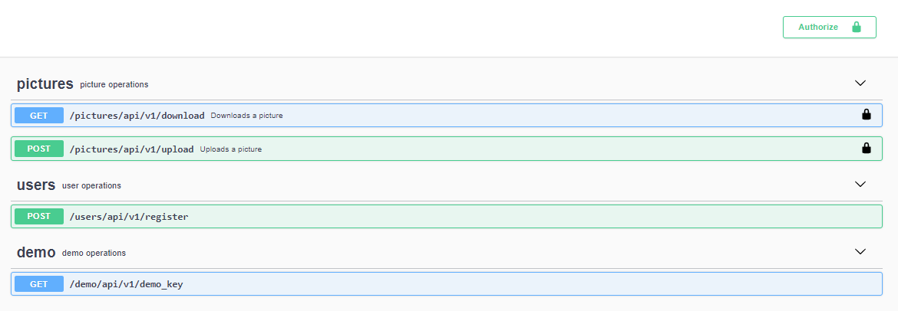

<h1>Space Fan Art (SFA - API)</h1>

Space Fan Art is an API tailored using Flask REST-Plus to automatically put a fascinating image of planets and galaxy on your desktop background.

> This project was an opportunity to study Flask REST-Plus and Software Security. 

<h1>Table of Contents</h1>

<!-- TOC -->
- [1. Overview](#1-overview)
    - [1.1. Prototype 1: monolithic architecture](#11-monolithic-architecture)
    - [1.2. Prototype 2: microservice-architecture](#12-microservice-architecture)
- [2. Interfaces](#2-interfaces)
- [3. Roadmap: development timeline](#2-roadmap-development-timeline)
    - [3.1. Version 1](#31-version-1)
    - [3.2. Version 2](#31-version-2)
    - [3.3. Version 3](#31-version-3)
    - [3.4. Version 4](#31-version-4)
- [4. Project Structure](#4-project-structure)
    - [4.1. Chapter 1](#41-chapter-1)
    - [4.2. Chapter 2](#42-chapter-2)
- [5. Dependencies](#5-dependencies) 
- [6. Installation](#7-installation)
- [7. Quick Start](#5-quick-start)
- [8. Authentication Details](#8-authentication-details)
<!-- /TOC -->

## 1. Overview 
This API, called SFA (Space Fan Art), is an API that automatically puts a fascinating image of planets and galaxies on your desktop background. Following the best practices proven to secure a REST-API, SFA-API provides access via a web browser and has an interface, which allows authenticated users to download and upload images. 

This paper describes a design proposal report for two versions: 

## 1.1. Prototype 1: monolithic architecture

* 1.1.Prototype 1 = Design based on a monolithic architecture, using MVC (Model-View-Controller) pattern. The images are taken from a local database (ngrok). Here a small NASA dataset of images is used (365 pictures). 

## 1.2. Prototype 2: monolithic architecture
* 1.2.Prototype 2 = Design based on a microservice architecture. The SFA-API is connected to a NASA Open API called Astronomy Picture Of The Day (APOD), which returns the picture of the day. 

## 2. Interfaces 

#### SWAGGER INTERFACE



#### WEB INTERFACE

C:\Users\Alice\Desktop\INTERFACE_SFS\index.html

## 2. Roadmap: development timeline 

#### Version 1 

This is the first version of SFA-API. It contains one endpoint that allows you to download an image.
```
* Description:
* HTTP Request Type -> GET
* Response -> Download file
* URL GET Parameters -> N/A
* Request URL (temporary): -> http://127.0.0.1:5000/pictures/api/v1/download
```
#### Version 2

This is the second version of SFA-API. It contains one more endpoint that allows you to upload an image.
```
* Description:
* HTTP Request Type -> POST
* Response -> Upload file
* URL GET Parameters -> file / title / explanation / date / copyright
* Request URL (temporary): -> http://127.0.0.1:5000/pictures/api/v1/upload
```
#### Version 3

This is the first version of SFA-API. It contains one more endpoint that allows you to register a new user.

```
* Description:
* HTTP Request Type -> POST
* Response -> Register user
* URL POST Parameters -> First name / Last name / email / password
* Request URL (temporary): -> http://127.0.0.1:5000/pictures/api/v1/register
```
#### Version 4 

This is the first version of SFA-API. It contains one more endpoint that allows you to use a demo key.

```
* Description:
* HTTP Request Type -> GET
* Response -> Get demo key
* URL GET Parameters -> N/A
* Request URL (temporary): -> http://127.0.0.1:5000/pictures/api/v1/demo_key
```
## 3. Project Structure


## 3. Project Files 

* `README.md` [README.md](https://github.com/alicevillar/sfa_api/blob/main/README.md)- Contains the description and documentation of the project. 
* `users_controller.py` [users_controller.py](https://github.com/alicevillar/sfa_api/blob/main/controllers/users_controller.py) - defines operations/endpoints with users (user registration).
* `picture_controller.py` [picture_controller.py](https://github.com/alicevillar/sfa_api/blob/main/controllers/picture_controller.py) - defines operations/endpoints with pictures (download and upload).
* `limiters_controller.py` [limiters_controller.py](https://github.com/alicevillar/sfa_api/blob/main/controllers/limiters_controller.py) - This is file implements the counting to limit the use of the API (through user's IP address) and demo key. 
* `demo_key_controller.py` [demo_key_controller.py](https://github.com/alicevillar/sfa_api/blob/main/controllers/demo_key_controller.py) - This file implements the demo key.
* `decorators.py` [decorators.py](https://github.com/alicevillar/sfa_api/blob/main/decorators.py) - This file contains the decorators for the api key and the demo key (to verify the existence and authenticity of the key).   
* `Dockerfile`[Dockerfile](https://github.com/alicevillar/sfa_api/blob/main/Dockerfile) - Docker config file is a recipe to build a Docker image
  running this RESTful API Server.
* `docker-compose.yaml` [docker-compose.yaml](https://github.com/alicevillar/sfa_api/blob/main/docker-compose.yaml) - This is a config file to deploy and configure the docker-container to run. 
* `minimal.py` [minimal.py](https://github.com/alicevillar/sfa_api/blob/main/minimal.py) - This is a config file containing the class API.  
* `populate_db.py` [populate_db.py](https://github.com/alicevillar/sfa_api/blob/main/populate_db.py) - This file is aimed to populate the database.
* `senhas.py` - This file contains the passwords of the database.
* `server.py` [server.py](https://github.com/alicevillar/sfa_api/blob/main/server.py) - This file imports controllers and runs the API. 
* `gitignore` [gitignore](https://github.com/alicevillar/sfa_api/blob/main/.gitignore)- Lists files and file masks of the files which should not be added to git repository.
* `requirements.txt` [requirements.txt](https://github.com/alicevillar/sfa_api/blob/main/requirements.txt) - The list of Python (PyPi) requirements.
 
## 4 Python Dependencies

* [**flask-restplus**](https://github.com/noirbizarre/flask-restplus) (+
  [*flask*](http://flask.pocoo.org/))  
* [**Werkzeug**](https://pypi.org/project/Werkzeug/) - for password hashing  
  RESTful API documentation.
* [**Secrets**](https://pypi.org/project/python-secrets/) - for generating cryptographically strong pseudo-random numbers for managing user authentication.
* [**Pyodbc**](https://pypi.org/project/pyodbc/) - for accessing the database and carry our user registration.
* [**Requests**](https://pypi.org/project/requests/) - for making HTTP requests in Python. 
 
 * flask-login 
* flask-cors
* flask-limiter
 
 
## Tools

* [**Docker**](https://www.docker.com/) - for storing the database (of the monolothic architecture) in a container.
* [**Swagger-UI**](https://github.com/swagger-api/swagger-ui) - for interactive

* aws
* sql server
* ngrok
* AWS EC2

  
## 4 Installation 

## 5 Quick Start  

## 6 Authentication Details

The request body must follow the following structure: 

#### User model:
{
  "First Name": "Teresa",
  "Last Name": "Saldanha",
  "Email": "mtsaldanha@terra.com.br",
  "Password": "123"
}

That is it! 

After regitration, the system will generate the API Key.

#### User registration:

```
curl -X POST "http://127.0.0.1:5000/users/api/v1/register" -H "accept: application/json" -H "Content-Type: application/json" -d "{ \"First Name\": \"Teresa\", \"Last Name\": \"Saldanha\", \"Email\": \"mtsaldanha@terra.com.br\", \"Password\": \"123\"}"
{
  "API Key": "1665Sg0UlrAq1BhZOstyPMj9DF-9d-i2o0DcIIB9",
  "Expiration Date": "2021-07-30"
}
```
The response body contains the API Key and the expiration date. Once the access authentication key expires, you have to create a new one. 

